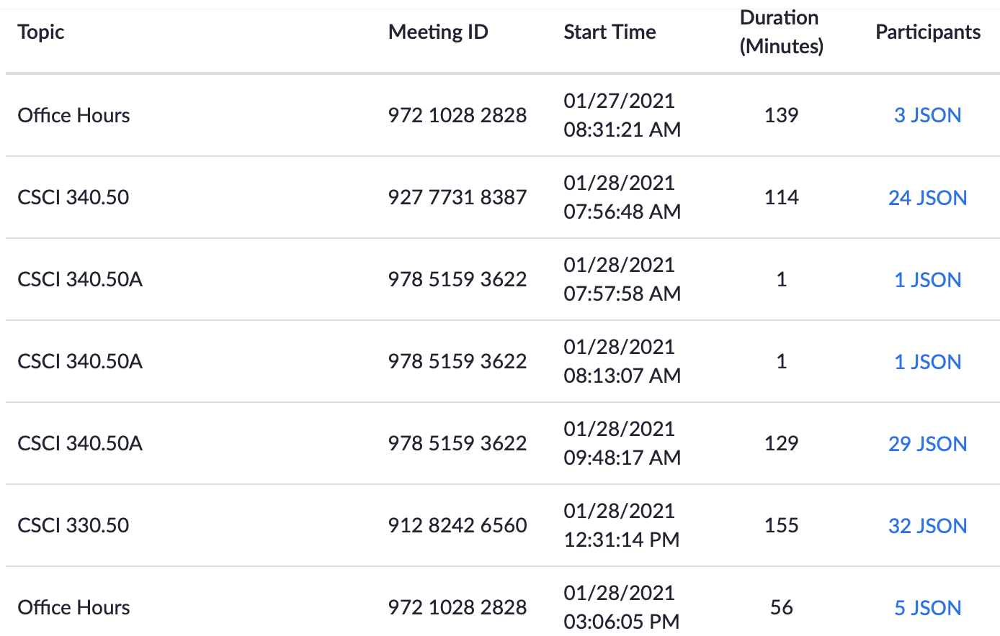

# Zoom JSON Scraper

A tool that can be used to provide readable attendance information for faculty from Zoom Meetings.

### Dependences

- Python >= 3.8 (a lower version may work, but I only tested with 3.8)
- A web browser that supports JavaScript
- Some level of hatred (or love) for Zoom
- **AUTHENTICATION WITH ZOOM** + students **not** renaming themselves.

## Components

### HTML Injector

- This component will add links to the Zoom meeting details page which will allow you to right-click and save a JSON file for later processing
- In order to use this component in the easiest way, I recommend adding the JS as a "bookmark" in your bookmarks bar.

```javascript
javascript:$('td.col6[data-column="table.p"]').each((i,e)=>{const%20anchor%20=%20$(e).children();const%20meetingId=encodeURIComponent(anchor.attr("data-id"));const%20userId=encodeURIComponent(anchor.attr("data-accountid"));$(e).append($('<a>').attr("href","https://millersville.zoom.us/account/my/report/participants/list?meetingId="+meetingId+"&accountId="+userId).attr("target","_blank").text("JSON"));});
```

The full, non-url code can be found under the file "inject.js"

When you have processed a search query for meetings and you are presented with the table, click on the bookmark entry. New links with the text of "JSON" should be automatically created.



### JSON Processor

- This component allows you to parse a downloaded JSON file and provide some level of engagement statistics.
- NOTE: this does not keep track of "active presence". This only checks when a student joins or leaves

#### Usage

```bash
python3 parse.py <host_email> <json_file> [start_offset] [duration]
# or
./parse.py <host_email> <json_file> [start_offset] [duration]

### EXAMPLE
./parse.py william.killian@millersville.edu 330.50-01-26.json
```

- `start_offset` how many minutes to offset when lecture started (for example, if the faculty joined 5 minutes before the start of class and wanted to give three minutes to students to get settled in, the offset would be `8`)
- `duration` override how long you want to cap attendance for (in minutes). Useful with the start offset to bind attendance to the scheduled class time.

#### Process

1. The program will process the JSON and find the time that the host joined.
2. All "start" times are then altered to be at least at that time.
3. The total time of attendance (in seconds) is calculated for each attendee
4. The population standard deviation is calculated as well as the z-score for each student.
5. If the z-score is below a threshold (-1.0), the student will be marked `L` for Late. Otherwise the student will be marked `P` for Present.

#### Sample Output

All Late students are listed first, with all Present students following. Students are ordered in alphabetical order by first name to match what D2L reports for attendance.

```
L Abe Zappa                      [ 86 min] (-1.38)
L Brittany Yoder                 [ 52 min] (-3.94)
L Charles Xi                     [ 68 min] (-3.77)
P Debby Whismer                  [119 min] ( 1.12)
P Ethan Von Trapp                [ 93 min] (-0.48)
P Felicia Umble                  [ 99 min] ( 0.28)
```

## Contact

For assistance or feature requests, please contact Will Killian [willkill07](https://github.com/willkill07) or open an issue.

## License

This software is licensed under the MIT License. See LICENSE for more information.